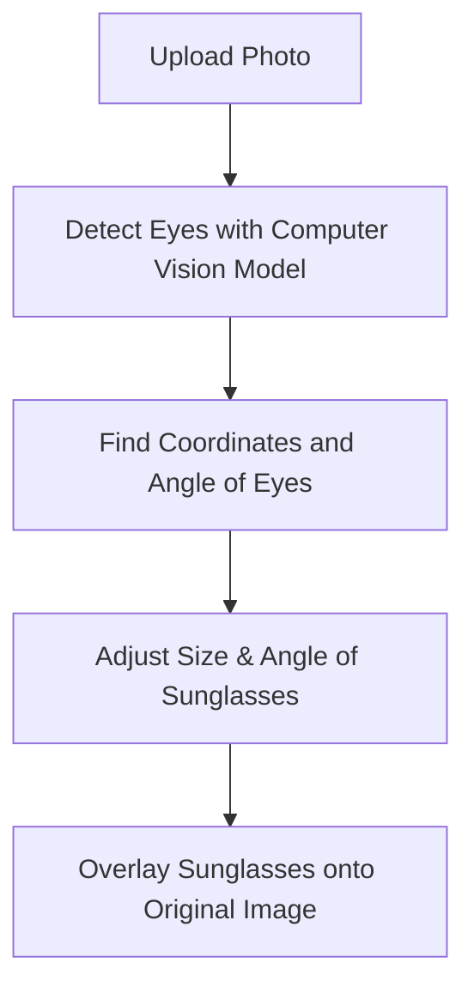

# Sunglassify 😎

### More detailed explanation [here!](https://medium.com/@ddanakim0304/how-i-used-pyqt-and-computer-vision-to-add-swag-to-photos-84e2e617755a)


Sunglassify is a desktop application that overlays virtual sunglasses on photos using advanced computer vision techniques. Built with Python, it provides an intuitive interface to upload, process, and save transformed images.


## Algorithm



## Features

- **GUI with PyQt5**: User-friendly interface for seamless interactions.
- **Face Detection with Mediapipe**: Uses Mediapipe's Face Mesh for precise eye landmark detection.
- **Image Processing with OpenCV and Pillow**: Powered by OpenCV and Pillow for efficient transformations.
- **Save Functionality**: Export edited images in various formats.

## Installation

### Prerequisites

- Python 3.6+  
- pip (Python package installer)

### Steps

1. **Clone the Repository**:
   ```bash
   git clone https://github.com/yourusername/sunglassify.git
   cd sunglassify

2. **Install Dependencies**:
   ```bash
   pip install -r requirements.txt

3. **Run the Application**:
   ```bash
   python sunglassify.py
Ensure a sunglasses.png image is in the same directory for overlays.
